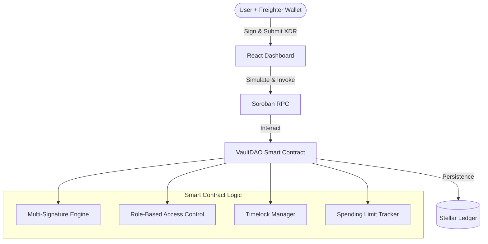

# VaultDAO Architecture

VaultDAO is a decentralized treasury management platform built on the Stellar network using Soroban smart contracts. This document outlines the technical architecture, component interactions, and security model.

## System Overview

The system consists of three main layers:

1.  **Soroban Smart Contracts**: Core logic for multi-sig, RBAC, and treasury management.
2.  **Frontend (React/TypeScript)**: User interface for managing vault operations.
3.  **Stellar Network (Testnet/Mainnet)**: The underlying infrastructure for transaction finality and data storage.

## Smart Contract Architecture (Rust)

The smart contract is written in Rust using the `soroban-sdk`. It is organized into several modules:

- **`lib.rs`**: Main entry point containing public contract functions.
- **`types.rs`**: Definitions for data structures like `Proposal`, `Role`, and `Config`.
- **`storage.rs`**: Helpers for managing Instance, Persistent, and Temporary storage.
- **`errors.rs`**: Custom error codes for the vault logic.
- **`events.rs`**: Standardized events emitted during contract execution.
- **`test.rs`**: Comprehensive unit and integration test suite.

### Storage Strategy

VaultDAO optimizes for ledger rent by using a hybrid storage model:

| Storage Type   | Usage                            | Rationale                                                        |
| :------------- | :------------------------------- | :--------------------------------------------------------------- |
| **Instance**   | `Config`, `Roles`                | Data that is consistently needed by every invocation.            |
| **Persistent** | `Proposals`, `RecurringPayments` | High-value data that must persist indefinitely.                  |
| **Temporary**  | `Daily/Weekly Limits`            | Ephemeral data that can be evicted after the time period passes. |

## Frontend Architecture (React)

The frontend is a modern SPA built with Vite, React, and Tailwind CSS.

- **Hooks**: Custom hooks (e.g., `useVaultContract`) encapsulate interaction with the Soroban RPC.
- **Context**: Manages wallet connection state (Freighter) and global configuration.
- **Components**: Modular UI components for proposal creation, list views, and status tracking.
- **Styling**: Responsive design using Tailwind CSS with glassmorphism aesthetics.

## Security Model

Security is central to VaultDAO's design:

1.  **M-of-N Multisig**: Proposals require a threshold of approvals from authorized signers before they can be executed.
2.  **Role-Based Access Control (RBAC)**:
    - `Admin`: Can manage roles and update configuration.
    - `Treasurer`: Can propose and approve transfers.
    - `Member`: View-only access (planned).
3.  **Timelocks**: Transfers exceeding the `timelock_threshold` are locked for a delay (e.g., 24 hours/2000 ledgers). This provides a window for legitimate signers to cancel malicious or accidental proposals.
4.  **Enforced Limits**: Spending limits for daily and weekly windows ensure that even if a key is compromised, the maximum drain is capped.

## Data Flow: Proposal Lifecycle

1.  **Propose**: A `Treasurer` creates a proposal via the frontend.
2.  **Approve**: Other `Treasurers` review and approve the proposal until the `threshold` is reached.
3.  **Timelock (Optional)**: If the amount is large, the proposal enters a `Timelock` state.
4.  **Execute**: After approvals are met and timelock expires, any authorized user can execute the transfer.
5.  **Finalize**: The contract transfers the assets to the recipient and marks the proposal as `Executed`.
